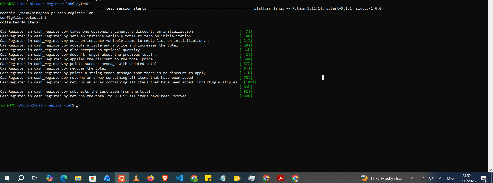

# Cash Register

An object-oriented Python simulation of a cash register for an e-commerce
site. It supports adding items with a price and quantity, applying a
percentage discount to the running total, and voiding the most recent
transaction.

## Description

This project defines a `CashRegister` class that models the core behavior
of a real cash register:

- **Add items** — track an item, its price, and quantity, and update the
  running total.
- **Apply a discount** — reduce the total by a percentage set when the
  register is created.
- **Void the last transaction** — remove the most recently added item(s)
  and correct the total and items list accordingly.

It was built as part of an Object-Oriented Programming (OOP) lab to
practice designing classes, using property decorators for validation, and
writing instance methods that call and build on one another.

## Installation

Clone this repository and move into the project directory:

```bash
git clone <your-forked-repo-url>
cd <repo-name>
```

No external dependencies are required to run the `CashRegister` class
itself. If you're running the test suite, install `pytest`:

```bash
pip install pytest
```

## Usage

Import the class and create a register, optionally passing in a discount
percentage (0–100):

```python
from cash_register import CashRegister

register = CashRegister(discount=20)

register.add_item("Shirt", 20.00, 2)   # item, price, quantity
register.add_item("Hat", 15.00)        # quantity defaults to 1

print(register.items)   # ['Shirt', 'Shirt', 'Hat']
print(register.total)   # 55.0

register.apply_discount()
# After the discount, the total comes to $44.0.

register.void_last_transaction()
print(register.items)   # ['Shirt', 'Shirt']
print(register.total)   # 40.0
```

### Class overview

| Attribute              | Description                                            |
|-------------------------|--------------------------------------------------------|
| `discount`              | Percentage (0–100) applied when `apply_discount()` runs |
| `total`                 | Running total of all items added                        |
| `items`                 | List of every item added (repeated per quantity)         |
| `previous_transactions` | History used to support voiding the last transaction     |

| Method                    | Description                                              |
|----------------------------|-----------------------------------------------------------|
| `add_item(item, price, quantity=1)` | Adds an item to the register and updates the total   |
| `apply_discount()`         | Applies the register's discount percentage to the total   |
| `void_last_transaction()`  | Removes the most recent transaction from the register     |

## Running the tests

```bash
cd lib
PYTHONPATH=. pytest testing/cash_register_test.py -v
```

## Screenshot

_Add a screenshot of your passing test output or terminal session below:_



## Support

If you run into issues, open an issue on this repository or reach out to
the maintainer directly.

## Roadmap

Possible future improvements:

- Support removing a specific item rather than only the last transaction.
- Add receipt/printout formatting.
- Support multiple stacked discounts (e.g. coupon + loyalty discount).

## Contributing

This is a lab project, so outside contributions aren't expected, but pull
requests and suggestions are welcome. To contribute:

1. Fork the project.
2. Create a feature branch (`git checkout -b feature/my-feature`).
3. Commit your changes with clear messages.
4. Push to your branch and open a pull request.

## Authors and acknowledgment

Built as part of the Object-Oriented Programming (Part 2) lab curriculum.

## License

This project is provided for educational purposes as part of a course lab
assignment.